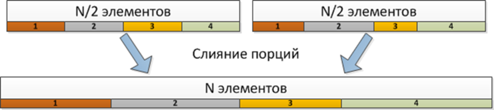

# PPHoareSort

# Сортировка хоара со слиянием "Разделяй и влавствуй"

## Структура?

|---- Build

|     |---- .gitignore

|

|---- Source

|     |---- *.h

|     |---- *.cpp

|

|---- libs

|

|---- images

|---- CMakeLists.txt

### Слияние «Разделяй и властвуй»

Идея слияния по алгоритму «Разделяй и властвуй» заключается в разбиении массивов на участки, которые можно слить независимо.
В первом массиве выбирается центральный элемент x (он разбивает массив на две равные половины), а во втором массиве с помощью
бинарного поиска находится позиция наибольшего элемента, меньшего x (позиция этого элемента разбивает второй массив на две части).
После такого разбиения первые и вторые половины массивов могут сливать независимо, т.к. в первых половинах находятся элементы меньшие
элемента x, а во второй – большие (рис. 8.3). Для слияния двух массивов несколькими потоками можно в первом массиве выбрать несколько 
ведущих элементов, разделив его на равные порции, а во втором массиве найти соответствующие подмассивы. Каждый поток получит свои порции
на обработку.

Эффективность такого слияние во многом зависит от того, насколько равномерно произошло «разделение» второго массива.

